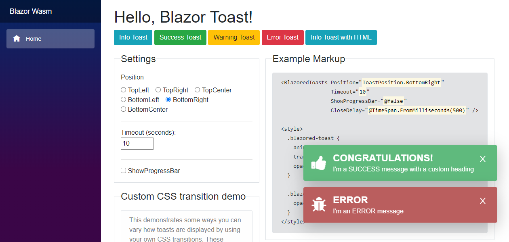

# Blazored Toast
This is a JavaScript free toast implementation for [Blazor](https://blazor.net) and Razor Components applications. It supports icons that are either specified by class name (such as fontawesome) or by a specified element (Material Design).




## Getting Setup
You can install the package via the NuGet package manager just search for *Blazored.Toast*. You can also install via powershell using the following command.

```powershell
Install-Package Blazored.Toast
```

Or via the dotnet CLI.

```bash
dotnet add package Blazored.Toast
```

### 1. Register Services
You will need to register the Blazored Toast service in your application

#### Blazor Server
Add the following line to your applications `Startup.ConfigureServices` method.

```csharp
public void ConfigureServices(IServiceCollection services)
{
    services.AddBlazoredToast();
}
```

#### Blazor WebAssembly
Add the following line to your applications `Program.Main` method.

```csharp
builder.Services.AddBlazoredToast();
```

### 2. Add Imports
Add the following to your *_Imports.razor*

```csharp
@using Blazored.Toast
@using Blazored.Toast.Services
```

### 3. Add reference to style sheet(s)
Blazored Toast uses CSS isolation. If your application is already using CSS isolation then the styles for Toast will be included automatically and you can skip this step. However, if your application isn't using isolated CSS, you will need to add a reference to the CSS bundle. You can checkout the [Microsoft Docs](https://learn.microsoft.com/en-us/aspnet/core/blazor/components/css-isolation?view=aspnetcore-6.0#css-isolation-bundling) for additional details.

```razor
<link href="{YOUR APP ASSEMBLY NAME}.styles.css" rel="stylesheet">
```

Presumably, if you want to use the Material Icons your project already includes some form of the icons. If not see [Material Design Icons](https://dev.materialdesignicons.com/getting-started/webfont) for the available alternatives.

### 4. Register and Configure Toasts Component
Add the `<BlazoredToasts />` tag into your applications *MainLayout.razor*.

Toasts are configured using parameters on the `<BlazoredToasts />` component. The following options are available.

- InfoClass
- InfoIcon
- SuccessClass
- SuccessIcon
- WarningClass
- WarningIcon
- ErrorClass
- ErrorIcon
- IconType (Default: IconType.FontAwesome)
- Position (Default: ToastPosition.TopRight)
- Timeout (Default: 5)
- ShowProgressBar (Default: false)
- ShowCloseButton (Default: true)
- CloseButtonContent (provide custom close button)
- MaxToastCount (Default: `int.MaxValue`)
- RemoveToastsOnNavigation (Default: false)

By default, you don't need to provide any settings everything will just work. But if you want to add icons to toasts or override the default styling then you can use the options above to do that. 

For example, to add an icon from Font Awesome to all success toasts you can do the following:

```razor
<BlazoredToasts SuccessIcon="fa fa-thumbs-up"/>
```

Setting the position also requires a reference to `Blazored.Toast.Configuration`, for example:

```razor
@using Blazored.Toast.Configuration

<BlazoredToasts Position="ToastPosition.BottomRight"
                Timeout="10"
                IconType="IconType.FontAwesome"
                SuccessClass="success-toast-override"
                SuccessIcon="fa fa-thumbs-up"
                ErrorIcon="fa fa-bug" />
```
The example above is from the [client side samples](https://github.com/Blazored/Toast/tree/master/samples).

```razor
<BlazoredToasts Position="ToastPosition.BottomRight"
                Timeout="10"
                IconType="IconType.Material"
                ErrorIcon="error_outline"
                InfoIcon="school"
                SuccessIcon="done_outline"
                WarningIcon="warning" />
```
The example above is from the [server side samples](https://github.com/Blazored/Toast/tree/master/samples) and demonstrates the use of Material Design icons.


If you want to have your own custom close button:
```razor
<BlazoredToasts Position="ToastPosition.BottomRight"
                Timeout="10">
    <CloseButtonContent>
        <div>
            <span>&times;</span>
        </div>
    </CloseButtonContent>
</BlazoredToasts>
```

## Usage
In order to show a toast you have to inject the `IToastService` into the component or service you want to trigger a toast. You can then call one of the following methods depending on what kind of toast you want to display, passing in a message and an optional heading.

- `ShowInfo`
- `ShowSuccess`
- `ShowWarning`
- `ShowError`


```razor
@page "/toastdemo"
@inject IToastService toastService

<h1>Toast Demo</h1>

To show a toast just click one of the buttons below.

<button class="btn btn-info" @onclick="@(() => toastService.ShowInfo("I'm an INFO message"))">Info Toast</button>
<button class="btn btn-success" @onclick="@(() => toastService.ShowSuccess("I'm a SUCCESS message with a custom title"))">Success Toast</button>
<button class="btn btn-warning" @onclick="@(() => toastService.ShowWarning("I'm a WARNING message"))">Warning Toast</button>
<button class="btn btn-danger" @onclick="@(() => toastService.ShowError("I'm an ERROR message"))">Error Toast</button>
```

### Show Progress Bar
You can display a progress bar which gives a visual indicator of the time remaining before the toast will disappear. In order to show the progress bar set the `ShowProgressBar` parameter to true.

```razor
<BlazoredToasts Position="ToastPosition.BottomRight"
                Timeout="10"
                ShowProgressBar="true" />
```

### Remove Toasts When Navigating
If you wish to clear any visible toasts when the user navigates to a new page you can enable the `RemoveToastsOnNavigation` parameter. Setting this to true will remove any visible toasts whenever the `LocationChanged` event fires.

### Limiting number of toasts shown at once
If you want to limit the number of toasts displayed at any given time, you can set the `MaxToastCount` parameter. For example, if the value is set to *3* only three toast instances will be displayed. Any additional toasts that are triggered will be held in a queue and will be displayed as older toasts time out.

### Custom Component
You can call the `ShowToast` method passing the type of component you want the toast to display.

For example if I have a component called `MyToast` which I want to display in the toast and I want to call it from the `Index` component on a button cick.

```razor
@page "/toastdemo"
@inject IToastService toastService

<h1>Custom Toast Demo</h1>

<button class="btn btn-primary" @onclick="@(() => toastService.ShowToast<MyToast>())">Custom Toast</button>
```

### Passing Parameters
If you want to pass values to the component you're displaying in the toast, then you can use the `ToastParameters` object. The name you provide must match the name of a parameter defined on the component being displayed.

```razor
@page "/toastdemo"
@inject IToastService toastService

<h1>Custom Toast Demo</h1>

<button class="btn btn-primary" @onclick="@(() => toastService.ShowToast<MyToast>(_toastParameters))">Custom Toast with parameters</button>

@code
{
    private ToastParameters _toastParameters;

    protected override void OnInitialized()
    {
        _toastParameters = new ToastParameters();
        _toastParameters.Add(nameof(MyToast.Heading), "MyToast heading");
        _toastParameters.Add(nameof(MyToast.Message), "MyToast message");
    }
}
```
### Custom Component Options
Custom toast components can be customized. These settings can be set globally or changed programatically on a per toast basis. This is achieved using the `ToastInstanceSettings` class.
The following settings are available.
- `Timeout`
- `ShowProgressBar`

For Example if you want to change the duration of the timeout and disable the progress bar.

```razor
@page "/toastdemo"
@inject IToastService toastService

<h1>Custom Toast Demo</h1>

<button class="btn btn-primary" @onclick="@(() => toastService.ShowToast<MyToast>(new ToastInstanceSettings(5, false)))">Custom Toast</button>
```

Full examples for client and server-side Blazor are included in the [samples](https://github.com/Blazored/Toast/tree/master/samples).

