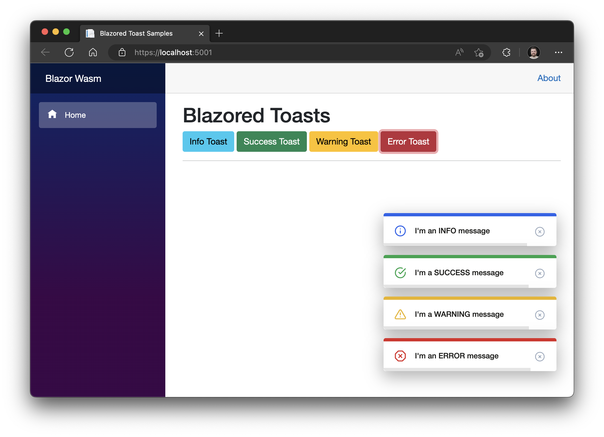

# Blazored Toast
This is a JavaScript free toast implementation for [Blazor](https://blazor.net) and Razor Components applications.

[](https://dev.azure.com/blazored/Toast/_build/latest?definitionId=3&branchName=master)




## Getting Setup
You can install the package via the NuGet package manager just search for *Blazored.Toast*. You can also install via powershell using the following command.

```powershell
Install-Package Blazored.Toast
```

Or via the dotnet CLI.

```bash
dotnet add package Blazored.Toast
```

### 1. Register Services
You will need to register the Blazored Toast service in your applications `Startup.ConfigureServices` method.

```csharp
public void ConfigureServices(IServiceCollection services)
{
    services.AddBlazoredToast();
}
```

### 2. Add Imports
Add the following to your *_Imports.razor*

```csharp
@using Blazored.Toast
@using Blazored.Toast.Services
```

### 3. Register and Configure Toasts Component
Add the `<BlazoredToasts />` tag into your applications *MainLayout.razor*.

Toasts are configured using parameters on the `<BlazoredToasts />` component. The following options are available.

- InfoClass
- InfoIconClass
- SuccessClass
- SuccessIconClass
- WarningClass
- WarningIconClass
- ErrorClass
- ErrorIconClass
- Position (Default: ToastPosition.TopRight)
- Timeout (Default: 5)

By default, you don't need to provide any settings everything will just work. But if you want to add icons to toasts or override the default styling then you can use the options above to do that. 

For example, to add a icon from Font Awesome to all success toasts you can do the following.

```html
<BlazoredToasts SuccessIconClass="fa fa-thumbs-up"/>
```

Setting the position also requires a reference to `Blazored.Toast.Configuration`, for example:

```html
@using Blazored.Toast.Configuration

<BlazoredToasts Position="ToastPosition.BottomRight"
                Timeout="10"
                SuccessClass="success-toast-override"
                SuccessIconClass="fa fa-thumbs-up"
                ErrorIconClass="fa fa-bug" />
```
The example above is from the [samples](https://github.com/Blazored/Toast/tree/master/samples).

### 4. Add reference to style sheet
Add the following line to the `head` tag of your `_Host.cshtml` (Blazor Server app).

```
<link href="_content/Blazored.Toast/blazored-toast.css" rel="stylesheet" />
```

## Usage
In order to show a toast you have to inject the `IToastService` into the component or service you want to trigger a toast. You can then call one of the following methods depending on what kind of toast you want to display, passing in a message and an optional heading.

- `ShowInfo`
- `ShowSuccess`
- `ShowWarning`
- `ShowError`


```html
@page "/toastdemo"
@inject IToastService toastService

<h1>Toast Demo</h1>

To show a toast just click one of the buttons below.

<button class="btn btn-info" @onclick="@(() => toastService.ShowInfo("I'm an INFO message"))">Info Toast</button>
<button class="btn btn-success" @onclick="@(() => toastService.ShowSuccess("I'm a SUCCESS message with a custom title", "Congratulations!"))">Success Toast</button>
<button class="btn btn-warning" @onclick="@(() => toastService.ShowWarning("I'm a WARNING message"))">Warning Toast</button>
<button class="btn btn-danger" @onclick="@(() => toastService.ShowError("I'm an ERROR message"))">Error Toast</button>
```
Full examples for client and server-side Blazor are included in the [samples](https://github.com/Blazored/Toast/tree/master/samples).

## FAQ
### The toasts are not showing
1. Check the `z-index` of your other `DOM Elements`, make sure that the `.blazored-toast-container` has a higher `z-index` than the other components.

